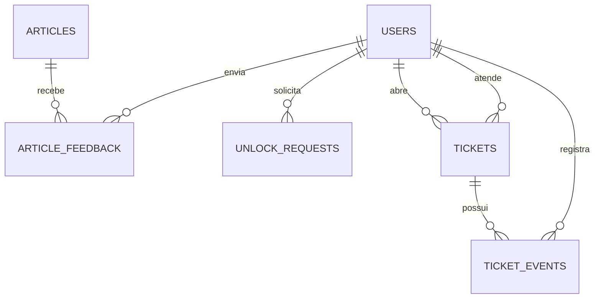

# Modelo fisico do banco

Diagrama de relacionamento entre as entidades do Portal de Autoatendimento de TI,
conforme definido em `docs/planejamento/05-contratos-dados-e-telas.md`.

## Enums

- `user_role`: EMPLOYEE, TECHNICIAN
- `article_category`: ACCESS, SOFTWARE, NETWORK, HARDWARE, SECURITY
- `ticket_category`: ACCESS, SOFTWARE, NETWORK, HARDWARE, SECURITY, OTHER
- `ticket_priority`: LOW, MEDIUM, HIGH, CRITICAL
- `ticket_status`: OPEN, TRIAGE, IN_PROGRESS, RESOLVED
- `unlock_status`: PENDING, VERIFIED, EXPIRED, BLOCKED

O DDL de referência está em `database/schema.sql`. A migration inicial executável fica
em `backend/migrations/versions/0001_initial_schema.py` e deve permanecer sincronizada
com os models de `backend/app/models/`.
